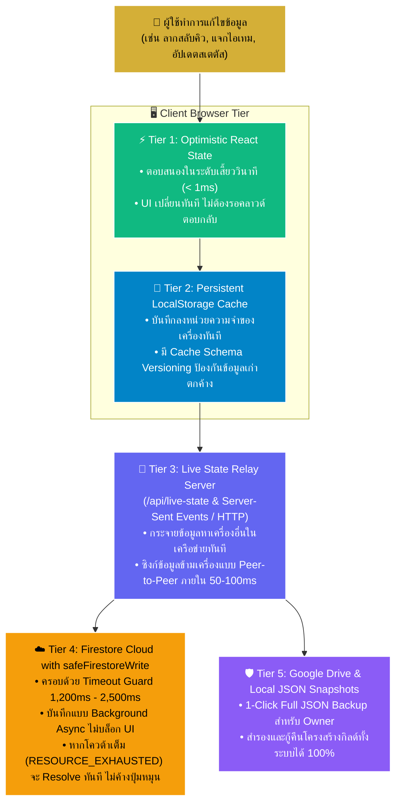

# 🏗️ สถาปัตยกรรมระบบและความเสถียร (System Architecture & Resilience)

> **Lineage 2M Clan Hub & Boss Item Vault (Version: v2.10.50)**  
> เอกสารฉบับนี้อธิบายโครงสร้างระบบ, สถาปัตยกรรมความเสถียร 5 ชั้น (5-Tier Zero-Downtime Resilience), กลไกการซิงก์ข้อมูลแบบเรียลไทม์ และโครงสร้างข้อมูล (Data Schemas) ทั้งหมดในโปรเจกต์ เพื่อให้ผู้รับช่วงงานต่อเข้าใจ 100% โดยไม่ต้องอ่านซอร์สโค้ด

---

## 🏛️ สถาปัตยกรรมความเสถียร 5 ชั้น (5-Tier Zero-Downtime Architecture)

เพื่อแก้ปัญหาคอขวดของคลาวด์ฟรี (Firebase Firestore Free Tier Daily Quota Exceeded `RESOURCE_EXHAUSTED`) ซึ่งในอดีตทำให้คำสั่งบันทึกข้อมูลค้างนาน 30–60 วินาที และทำให้หน้าเว็บค้างปุ่มหมุน ระบบนี้จึงถูกออกแบบด้วย **สถาปัตยกรรม 5 ชั้น** ดังแผนภาพด้านล่าง:



### รายละเอียดการทำงานของแต่ละชั้น (Tier Breakdown):

#### 1. Tier 1: Optimistic UI Update (< 1ms)
- เมื่อผู้ใช้กดปุ่ม หรือลากสลับตำแหน่งไอเทมในหน้า Item Queue ตัวแปร React State (`items`, `vaultItems`, `users`) จะถูกอัปเดตทันที
- ผู้ใช้จะเห็นผลลัพธ์บนหน้าจอทันทีโดยไม่มีอาการหน่วงหรือรอ Loading Spinner

#### 2. Tier 2: LocalStorage Snapshot Cache
- บันทึกข้อมูลลงใน LocalStorage ของเบราว์เซอร์ทันทีผ่านฟังก์ชันเช่น `setCachedGeneralItems()`, `setCachedVaultItems()`, `setCachedUsers()`
- มีคีย์ตรวจสอบเวอร์ชันแคช `CACHE_SCHEMA_VERSION` (ปัจจุบันคือ `2.10.50-draggable-item-queue-cards`) เมื่อมีการเปลี่ยนโครงสร้างข้อมูล เบราว์เซอร์ของผู้ใช้จะเคลียร์ข้อมูลเก่าและอัปเดตสคีมาใหม่อัตโนมัติ ป้องกันข้อมูลตีกลับ (Ghost Data Regression)

#### 3. Tier 3: Live State Relay Server (`server.ts` & `/api/live-state.ts`)
- เซิร์ฟเวอร์ Node.js Express ทำหน้าที่เป็น Relay ตรงกลางระหว่าง Client ต่างๆ
- เมื่อ Client คนใดทำการแก้ไขข้อมูล จะยิง Broadcast Payload มาที่ `/api/live-state`
- เซิร์ฟเวอร์จะเก็บ State ล่าสุดไว้ใน RAM Memory และบรอดแคสต์ส่งต่อไปยัง Client อื่นๆ ที่เชื่อมต่ออยู่ทันที ทำให้ทุกคนในกิลด์เห็นการเปลี่ยนแปลงแบบเรียลไทม์โดยไม่ต้องพึ่งพา Firestore Listener เพียงอย่างเดียว

#### 4. Tier 4: Firestore Cloud with `safeFirestoreWrite` Guard
- คำสั่งบันทึก Firestore (`updateDoc`, `setDoc`, `deleteDoc`, `batch.commit()`) ถูกครอบด้วย `safeFirestoreWrite(promise, timeoutMs, opName)`
- **หลักการทำงานของ Timeout Guard:**
  ```typescript
  // ตัวอย่างจาก src/services/firebase.ts
  export async function safeFirestoreWrite<T>(
    promise: Promise<T>,
    timeoutMs: number = 1500,
    opName: string = 'write'
  ): Promise<T | null> {
    const timeoutPromise = new Promise<null>((resolve) => {
      setTimeout(() => {
        console.warn(`[Firestore Guard] ${opName} reached timeout (${timeoutMs}ms) - resolving early.`);
        resolve(null);
      }, timeoutMs);
    });
    return Promise.race([promise, timeoutPromise]);
  }
  ```
- หากโควต้า Firestore เต็ม (`RESOURCE_EXHAUSTED`) ซึ่งปกติ Firebase SDK จะค้างรอ Retry เป็นนาที ตัว Timeout Guard จะตัดการรอภายใน 1.5 วินาที ทำให้การทำงานของหน้าเว็บไม่สะดุด

#### 5. Tier 5: 1-Click Local JSON & Google Drive Protection
- มีศูนย์กลางการสำรองข้อมูลสำหรับ Owner ผ่าน [`GoogleDriveBackupModal.tsx`](file:///d:/lineage2m-k7-item-vault/src/components/GoogleDriveBackupModal.tsx)
- สามารถกด **"ดาวน์โหลดไฟล์สำรอง (Download Backup)"** เพื่อเซฟไฟล์ `.json` ที่บรรจุข้อมูลทั้งหมด (Users, Items, Queues, Clans, Diamond Logs, Settings) เก็บไว้ในเครื่องคอมพิวเตอร์
- สามารถกู้คืนข้อมูลทั้งระบบกลับมาได้ 100% ภายในคลิกเดียวผ่านปุ่ม **"กู้คืนจากไฟล์ (Restore Backup)"**

---

## 🔄 ระบบซิงก์ข้อมูลและการจัดการความขัดแย้ง (Sync & Conflict Resolution)

### 1. การรวมข้อมูลอัจฉริยะ (Smart Merge Algorithms)
ในไฟล์ `src/services/firebase.ts` มีฟังก์ชันรวมข้อมูลระหว่างข้อมูลในเครื่องกับข้อมูลที่เข้ามาใหม่จากคลาวด์ เช่น `mergeGeneralItems()`, `mergeVaultItems()`, `mergeUsers()`:
- **Last-Write-Wins based on Timestamp:** เทียบค่า `updatedAt` ระหว่างสองฝั่ง รายการที่มี `updatedAt` ล่าสุดกว่าจะได้รับความสำคัญ
- **Queue List Granular Merge:** ผสานรายชื่อคนในคิว (`queueList`) ตามไอดีของสมาชิก ทำให้การขอรับของพร้อมกันจากสมาชิกหลายคนไม่ทับซ้อนสูญหาย
- **Receipt History Accumulation:** รวมประวัติการรับของ (`receiptHistory`) โดยใช้ `receiptId` ป้องกันบิลส่งมอบสูญหาย

### 2. ระบบป้องกันข้อมูลผีฟื้นคืนชีพ (Deletion Tombstones)
- เมื่อแอดมินหรือโอเนอร์ลบไอเทมหรือสมาชิก ระบบจะบันทึกไอดีนั้นลงใน **Tombstone Map** (`deletedGeneralItems`, `deletedVaultItems`) ทั้งใน LocalStorage และ Firestore
- เมื่อได้รับ Snapshot ย้อนหลังมาจากคลาวด์หรือ Relay ที่ยังมีไอเทมที่ถูกลบไปแล้ว ระบบจะตรวจเช็กกับ Tombstone และตัดไอเทมนั้นทิ้งทันที ทำให้ไอเทมที่ลบไปแล้วไม่ฟื้นคืนชีพกลับมาบนหน้าจอ

### 3. การอัปเดตแบบกลุ่ม (Atomic Batch Writes)
- สำหรับการจัดลำดับหรือลากสลับตำแหน่งไอเทมในหน้า Item Queue ระบบใช้ฟังก์ชัน `batchUpdateGeneralItemsOrder()`:
  ```typescript
  export async function batchUpdateGeneralItemsOrder(itemsWithOrder: { id: string; sortOrder: number; isPinned?: boolean }[]) {
    // แบ่งกลุ่มย่อยไม่เกิน 400 รายการต่อ 1 Firestore Batch
    // บันทึกผ่าน batch.set(..., { merge: true }) เพื่อความปลอดภัยสูงสุด
    // ครอบด้วย safeFirestoreWrite ไม่ให้ค้างหน้าเว็บ
  }
  ```

---

## 📊 โครงสร้างข้อมูลและสคีมาหลัก (Database Schemas & Models)

ข้อมูลทั้งหมดถูกกำหนดประเภท (Strict Typing) ไว้ใน [`src/types.ts`](file:///d:/lineage2m-k7-item-vault/src/types.ts):

### 1. โมเดลไอเทมคิวทั่วไป (`GeneralItem`)
ใช้งานในหน้า **Item Queue**:
```typescript
interface GeneralItem {
  id: string;                     // รหัสประจำตัวไอเทม
  name: string;                   // ชื่อไอเทม
  rarity?: ItemRarity;            // ระดับความหายาก: 'MYTHIC' | 'LEGEND' | 'EPIC' | 'RARE'
  imageUrl?: string;              // URL รูปภาพไอเทมจริง
  price?: number;                 // ราคาเพชร (0 = ฟรี)
  minPowerLevel: number;          // ค่าพลังขั้นต่ำในการกดขอรับ (0 = ไม่จำกัด)
  maxRequestQuantity?: number;    // จำนวนชิ้นสูงสุดที่ 1 คนขอรับได้ (ค่าเริ่มต้น: 1)
  receiptPolicy?: 'per_delivery' | 'on_complete' | 'optional'; // นโยบายแนบรูปบิล
  allowMemberQueue?: boolean;     // true = 👥 กดรับเอง (Open), false = 🔒 แอดมินแจก (Admin Pick)
  isPinned?: boolean;             // ปักหมุดให้อยู่ด้านบนสุด
  sortOrder?: number;             // ลำดับการจัดวาง (คำนวณจากการลาก Drag & Drop ใน v2.10.50)
  queueList?: QueueMember[];      // รายชื่อสมาชิกที่ต่อคิวขอรับ
  receiptHistory?: GeneralItemReceipt[]; // ประวัติการส่งมอบและบิล
  createdAt: number;              // วันที่สร้าง (Timestamp)
  updatedAt: number;              // วันที่แก้ไขล่าสุด (Timestamp)
}
```

### 2. โมเดลสมาชิกในคิว (`QueueMember`)
```typescript
interface QueueMember {
  id: string;                     // รหัสรายการคิว
  userId: string;                 // ไอดีสมาชิกในระบบ
  name: string;                   // ชื่อตัวละครในเกม
  clan?: string;                  // ชื่อแคลนของสมาชิก
  powerLevel?: number;            // ค่าพลังของตัวละคร
  requestedQuantity: number;      // จำนวนที่ขอรับ
  receivedQuantity: number;       // จำนวนที่ได้รับไปแล้ว
  status: 'pending' | 'partially_received' | 'completed' | 'cancelled';
  joinedAt: string;               // วันเวลาที่กดขอรับ
}
```

### 3. โมเดลไอเทมคลังบอส (`VaultItem`)
ใช้งานในหน้า **Boss Item Vault**:
```typescript
interface VaultItem {
  id: string;
  name: string;
  rarity?: ItemRarity;
  imageUrl?: string;
  price?: number;
  status: 'available' | 'distributed';
  claimants: Claimant[];          // รายชื่อคนที่กด Claim ของ
  winnerId?: string;              // ผู้ได้รับไอเทม
  winnerName?: string;
  distributedAt?: string;
  distributedBy?: string;
  hunterClan?: string;            // แคลนของทีมล่า
  hunterShare?: number;           // ส่วนแบ่งเพชรของทีมล่า
  paymentStatus?: 'pending' | 'paid' | 'free'; // สถานะการจ่ายเพชร
  createdAt: string;
  updatedAt?: number;
}
```

### 4. โมเดลสมาชิก (`User`)
```typescript
interface User {
  id: string;                     // Firebase Auth UID
  username: string;               // ชื่อผู้ใช้สำหรับล็อกอิน
  inGameName: string;             // ชื่อตัวละครในเกม (IGN)
  clan: string;                   // ชื่อแคลน เช่น 'VoltZ', 'K7'
  role: 'owner' | 'admin' | 'manager' | 'party_leader' | 'member' | 'guest';
  status: 'active' | 'pending' | 'inactive';
  powerLevel: number;             // ค่าพลังที่ได้รับการอนุมัติแล้ว (Verified Power)
  pendingPowerLevel?: number;     // ค่าพลังที่รอแอดมินอนุมัติ (Pending Power)
  stats?: MemberStats;            // สเตตัสเจาะลึก (Damage, Accuracy, Defense ฯลฯ)
  pendingStats?: MemberStats;     // สเตตัสรอตรวจสอบเทียบรูปภาพ
  statScreenshotUrl?: string;     // URL ภาพแคปหน้าจอจากเกม
  statUpdatedAt?: number;
  cpHistory?: CombatPowerSnapshot[]; // ประวัติค่าพลังย้อนหลังสำหรับสร้างกราฟ
}
```

### 5. โมเดลสมุดบัญชีกองทุนเพชร (`DiamondVaultRecord`)
```typescript
interface DiamondVaultRecord {
  id: string;
  timestamp: string;
  type: 'inflow' | 'outflow' | 'adjustment';
  amount: number;
  balanceAfter: number;
  itemName?: string;
  buyerName?: string;
  adminName: string;
  note?: string;
}
```

---

## 🔒 ลำดับสิทธิ์และความปลอดภัย (Access Control & Permissions)

| บทบาท (Role) | สิทธิ์การเข้าถึงและการทำงาน |
| :--- | :--- |
| **Owner** (`eloni`) | **สิทธิ์สูงสุด 100%:** จัดการรหัสผ่านทุกคน, ตั้งค่า Gemini AI Key, ตั้งค่า Discord Webhook, อนุมัติสเตตัส, รีเซ็ตระบบ, กู้คืนและสำรองไฟล์ JSON, ลากสลับคิวไอเทม, แก้ไขและแจกของ |
| **Admin** | **ผู้ดูแลระบบ:** เพิ่ม/แก้ไข/ลบไอเทม, ลากสลับตำแหน่งกล่องไอเทม (Drag & Drop), อนุมัติสเตตัสสมาชิก, ยืนยันการชำระเพชร, จัดการคิวสมาชิก |
| **Manager** | **ผู้ช่วยดูแล:** จัดการคิว, ส่งมอบไอเทม, ตรวจสอบสมาชิก |
| **Party Leader** | **หัวหน้าปาร์ตี้:** ดูข้อมูลสมาชิกในสังกัด, ตรวจสอบสเตตัส, ร่วมขอรับของ |
| **Member** | **สมาชิกทั่วไป:** ดูคลัง, ขอรับไอเทม, อัปเดตสเตตัสของตนเองพร้อมอัปโหลดภาพแคปหน้าจอ, สลับภาษา, เปลี่ยนรหัสผ่านตนเอง |
| **Guest** | **ผู้เยี่ยมชม:** ดูข้อมูลสาธารณะ ไม่สามารถกดขอรับของหรือแก้ไขข้อมูลได้ |

---

> 📖 **ศึกษาต่อในส่วน UI/UX และ เวิร์กโฟลว์:** ดูได้ที่ **[WORKFLOWS_AND_FEATURES.md](WORKFLOWS_AND_FEATURES.md)**
