# 🏛️ SYSTEM_ARCHITECTURE.md — สถาปัตยกรรมระบบและคู่มือป้องกันโค้ดเสียหาย
> **Lineage 2M Clan Hub & Boss Item Vault (Version: v2.1.0 — อัปเดตล่าสุด)**  
> **Last Updated:** 2026-09-16  
> **Live Production:** [https://lineage2m-k7-item-vault.vercel.app/](https://lineage2m-k7-item-vault.vercel.app/)  
> **Repository:** `tinnakornid2/lineage2m-k7-item-vault`

---

## 🎯 วัตถุประสงค์ของเอกสารฉบับนี้ (Purpose)
เอกสารนี้จัดทำขึ้นเป็น **แผนผังวิศวกรรมระบบแม่บท (Master Engineering Blueprint)** เพื่อให้ AI Assistant หรือนักพัฒนาในอนาคต:
1. **ไม่ไปแก้ไขส่วนอื่นโดยไม่จำเป็น (Prevent Unintended Regressions):** รู้ว่าส่วนไหนทำงานสมบูรณ์แล้วและห้ามแตะต้อง
2. **เข้าใจจุดเชื่อมต่อระบบ (System Integrations):** เข้าใจความสัมพันธ์ระหว่าง Firestore, Express Backend, Vercel Static Hosting, และ Google Gemini AI
3. **มีแนวทางต่อยอดฟังก์ชันที่ปลอดภัย (Safe Extension Pathways):** รู้วิธีเพิ่มฟีเจอร์ใหม่อย่างเป็นระเบียบ โดยไม่ทำให้ฟีเจอร์เดิมเสียหาย

---

## ⛔ 1. โซนแกนกลางที่ห้ามแก้ไขโดยไม่จำเป็น (PROTECTED CORE — DO NOT TOUCH)

> [!CAUTION]
> ห้ามแก้ไข, ลบ, หรือเขียนทับโค้ดใน 10 ส่วนนี้โดยเด็ดขาด เว้นแต่ผู้ใช้งานจะสั่งการเฉพาะเจาะจงในจุดนั้นโดยตรง:

### 1.1 ระบบโมเดล AI OCR และการทำงานบน Vercel (`src/components/VaultView.tsx` & `server.ts`)
- **โมเดลที่ใช้งานได้จริง:** ต้องคงรายการ `candidateModels` เป็นโมเดลปัจจุบันของ Google API ได้แก่:
  ```ts
  const candidateModels = [
    "gemini-flash-latest",
    "gemini-3.5-flash",
    "gemini-3.1-flash-lite",
    "gemini-flash-lite-latest",
    "gemini-3-flash-preview",
    "gemini-3.6-flash"
  ];
  ```
  *⚠️ ห้ามนำโมเดล `gemini-1.5-flash`, `gemini-2.0-flash`, `gemini-2.5-flash` กลับมาเด็ดขาด เพราะ Google ปิดการเข้าถึงสำหรับผู้ใช้ใหม่แล้ว (จะส่งผลให้ระบบพังด้วย Error 404)*
- **การแยกแยะสภาพแวดล้อม (Local vs Vercel):**
  ```ts
  const isLocalhost = typeof window !== 'undefined' && 
    (window.location.hostname === 'localhost' || window.location.hostname === '127.0.0.1');
  ```
  *⚠️ บน Vercel ไม่มี Express backend รันอยู่ (`!isLocalhost`) ระบบต้องเรียก `runDirectGeminiClientOcr` จากฝั่ง Client โดยตรง ห้ามพยายามส่ง POST ไปยัง `/api/scan-hunters` บน Vercel เพราะจะได้ผลตอบกลับเป็นหน้าเว็บ HTML (`index.html`)*
- **สิทธิ์การใช้งาน OCR:** แอดมินและผู้จัดการทุกคน (`owner`, `admin`, `manager`) สามารถใช้งานระบบ OCR ได้อย่างเท่าเทียม โดยมีป้ายสถานะระบบ Gemini AI แสดงผลชัดเจน

### 1.2 กฎเหล็กระบบสองภาษา 100% (Rule 1: Bilingual Compliance)
- **ห้าม Hardcode ภาษาเดียวในทุกจุดของ UI:**
  - ข้อความ, ปุ่ม, ป้าย, Dropdown, กล่องข้อความ Placeholder, Toast, และ Alert ต้องรองรับทั้ง **ไทย (TH)** และ **อังกฤษ (EN)**
  - การเขียนข้อความต้องอิงจาก `translations[lang]` หรือ `lang === 'th' ? '...' : '...'` เสมอ

### 1.3 ระบบคุ้มครองบัญชีเจ้าของสูงสุด (Immutable Owner Protection)
- บัญชี `user_owner_eloni` (Username: `eloni`) เป็นเจ้าของระบบสูงสุด:
  - **ห้าม** ลดขั้นบทบาท (`role`) ของ `eloni` จาก `'owner'` เป็นบทบาทอื่นโดยเด็ดขาด
  - **ห้าม** แสดงปุ่มลบหรือคำสั่งลบบัญชี `eloni` ในระบบ
  - ฟังก์ชันระดับสูง เช่น **Owner Reset Center** (`OwnerResetModal.tsx`), **ตั้งค่า Gemini Key** (`GeminiKeyModal.tsx`), และ **ปุ่มรีเซ็ตยอดเพชร** (`DiamondVaultModal.tsx`) ต้องตรวจสอบสิทธิ์ `isOwner` (`currentUser.role === 'owner'`) เท่านั้น

### 1.4 การคำนวณค่าพลังและซิงค์สูตรแบบ Real-time (`powerFormulaService.ts` & `PowerFormulaSettingsModal.tsx`)
- สูตรคำนวณถูกจัดเก็บไว้ที่ Firestore `app_settings/power_formula`
- เมื่อ Owner มีการปรับแก้น้ำหนักสูตร ทุกไคลเอนต์จะได้รับ Event แบบเรียลไทม์ และคำนวณ Power Level (PL) ใหม่ทันที
- การคำนวณค่าพลังต้องผ่านฟังก์ชันกลาง `calculatePowerLevel(stats, formula)` เท่านั้น ห้ามเขียนสูตร Hardcode แยกในแต่ละ Component

### 1.5 หน้าต่างลอยตรึงรูปหลักฐานเทียบสเตตัส (`Floating Pinned Proof` ใน `src/components/MyStatsView.tsx`)
- สมาชิกระบบสามารถกด **"📌 ดูรูปเทียบสเตตัส"** เพื่อเปิดหน้าต่างรูปภาพหลักฐานลอยขึ้นมาขณะกรอกตัวเลข
- โค้ดส่วนนี้มีระบบปรับขนาด 3 สัดส่วน (S / M / L Split-view) พร้อมปุ่มซูม 100% แบบ Uncropped ห้ามลบฟังก์ชันนี้

### 1.6 มาตรฐานสีเพชรขาวสว่าง (White Diamond & Font Standard)
- ตามความต้องการของระบบล่าสุด ไอคอนเพชร (`Gem` icon) และตัวเลขยอดคงเหลือ/ราคาเพชรทั้งหมดต้องใช้ **สีขาวสว่าง (`text-white font-mono font-bold`)** พร้อมประกายเงา ห้ามเปลี่ยนกลับเป็นสีฟ้าใน Component ต่อไปนี้:
  - `Sidebar.tsx` (Desktop Quick Card & Mobile Top Button)
  - `Navbar.tsx` (Diamond Trigger Widget)
  - `DashboardView.tsx` (Diamond Vault Box & Items Table Price Column)
  - `VaultView.tsx` (Input Price Box, Distributed Table, Viewing Modal)
  - `DiamondVaultModal.tsx` & `DistributionStatsModal.tsx`

### 1.7 กฎการทดสอบและการ Deploy (Rule 2: Local First Rule)
- ทุกการแก้ไขต้องทดสอบบนเครื่อง Localhost (`http://localhost:3000`) ก่อนเสมอ
- ตรวจสอบความถูกต้องด้วย `tsc --noEmit` และ `vite build`
- **ห้ามรัน `git push` หรือ deploy สู่ Vercel จนกว่าผู้ใช้งานจะสั่งการชัดเจน**

### 1.8 ระบบการอนุมัติแบบทีละคนอย่างเคร่งครัด (Strict Individual 1-by-1 Approval)
- **การอนุมัติสเตตัสและการอนุมัติสมาชิกใหม่ต้องทำ "ทีละคน" (One by One) เท่านั้น:**
  - **ห้าม** สร้างหรือเพิ่มปุ่ม "อนุมัติทั้งหมด" (Approve All) โดยเด็ดขาด เพื่อป้องกันความผิดพลาดในการตรวจสอบหลักฐาน
  - ใน `StatApprovalView.tsx`, `StatApprovalModal.tsx`, และ `MembersView.tsx` แต่ละการ์ดมีปุ่มอนุมัติเฉพาะของสมาชิกคนนั้น
  - ทุกปุ่มอนุมัติต้องมีสถานะ **`processingUserId / processingMemberId`** เพื่อแสดง Spinner `กำลังอนุมัติ...` / `Approving...` และปิดปุ่มชั่วคราวขณะประมวลผล เพื่อป้องกันการกดเบิ้ล (Anti-Double Click)
  - ทุกการอนุมัติต้องแสดง **Toast Notification ระบุชื่อสมาชิกที่ได้รับการอนุมัติอย่างชัดเจน** ทั้งภาษาไทยและอังกฤษ

### 1.9 ระบบมาตรฐานการคำนวณยอดกองทุนเพชรแคลน (`src/utils/diamondHelper.ts`)
- **การคำนวณยอดเพชรต้องเริ่มจาก 0 เสมอ:**
  - ยอดคงเหลือคำนวณจากประวัติการทำรายการจริงใน Firestore ผ่านฟังก์ชัน `computeTotalVaultBalance(diamondLogs)`
  - ห้ามฮาร์ดโค้ดยอดตั้งต้น (เช่น 150000) ใน `App.tsx` หรือ Component ใดๆ
  - ยอดในหน้า Dashboard, Sidebar, Navbar และป๊อปอัพกองทุนเพชรแคลน ต้องแสดงตัวเลขตรงกัน 100%
- **ระบบรีเซ็ตยอดเพชรเฉพาะ Owner:**
  - รองรับ 2 โหมด: `wipe` (ล้างประวัติทั้งหมดและตั้งยอดเริ่มต้นใหม่) หรือ `adjust` (บันทึกรายการปรับยอดอัตโนมัติ)

### 1.10 ระบบความจำชื่อไอเทมและรูปบิลใบเสร็จ (`VaultView.tsx`, `DistributeItemModal.tsx`, `EditVaultItemModal.tsx`)
- ระบบช่วยจำชื่อไอเทม Autocomplete ดึงจากประวัติคลังเดิมและ `localStorage` (`l2m_recent_item_names`)
- รองรับการแนบรูปภาพบิล/ใบเสร็จได้หลายใบต่อ 1 ไอเทม (`receiptImages: string[]`) สำหรับไอเทมที่แจกแล้ว พร้อมหน้าต่างซูมแกลเลอรี

---

## 🛠️ 2. คู่มือการต่อยอดฟังก์ชันในอนาคต (SAFE EXTENSION GUIDE)

### 2.1 การเพิ่มแท็บเมนูใหม่ในระบบ (Adding New View Tab)
1. เพิ่มชื่อแท็บใน `src/types.ts` (`ActiveTab`)
2. เพิ่มข้อความสองภาษาใน `src/translations.ts` (`tabNewFeature`)
3. เพิ่มปุ่มเมนูใน `src/components/Sidebar.tsx`
4. สร้างคอมโพเนนต์ใหม่แยกไฟล์และนำไปเรียกใช้ใน `src/App.tsx`

### 2.2 การเพิ่มคอลเลกชันใหม่ใน Firestore (Adding New Firestore Collection)
1. เพิ่มชื่อคอลเลกชันใน `src/services/firebase.ts`
2. ใช้ฟังก์ชัน `sanitizeForFirestore(data)` เสมอเพื่อตัดค่า `undefined`

### 2.3 การตั้งค่าการแจ้งเตือน Discord Webhook และ Role Mentions (v2.1.0)
1. เข้าไปที่ `src/utils/discord.ts`
2. ระบบรองรับ `mentionType`: `'everyone' | 'role' | 'none'` และ `mentionRoleId: string`
3. จัดเก็บค่าลงใน Firestore `app_settings/discord`
4. บน Backend `server.ts` ได้กำหนด `allowed_mentions: { parse: ['everyone', 'roles', 'users'], roles: [roleId] }` เพื่อให้ Discord API ส่ง Ping แจ้งเตือนไปยัง Role ID นั้นได้ถูกต้อง

### 2.4 สถาปัตยกรรม Tab State & URL Hash Persistence (v2.1.0)
- ควบคุมผ่าน `window.location.hash` และ fallback สู่ `localStorage` (`l2m_active_tab`)
- เมื่อกดรีเฟรช F5 หรือปุ่มนำทางบราวเซอร์ (Back/Forward) Event listener `hashchange` จะทำการซิงค์ `activeTab` กลับมาที่หน้าเดิมอัตโนมัติ

### 2.5 สถาปัตยกรรม Fluid Responsive Scaling (v2.1.0)
- กำหนดคอนเทนเนอร์หลักใน `src/App.tsx`: `w-full max-w-full 2xl:max-w-[1920px] mx-auto px-2.5 sm:px-4 md:px-6 lg:px-7 py-3 sm:py-5 min-w-0 transition-all`
- ทำให้แอปปรับขนาดความกว้างตามหน้าต่างบราวเซอร์แบบ Real-time โดยไม่เสียสัดส่วน รองรับทั้งหน้าต่างย่อครึ่งจอ (Split screen) และจอมอนิเตอร์ Ultrawide

---

## 🗺️ 3. แผนผังคอมโพเนนต์และการเชื่อมต่อข้อมูล (Component & Data Map)

```mermaid
graph TD
    A[App.tsx - Global State Controller] --> B[Sidebar.tsx - Main Navigation]
    A --> C[Navbar.tsx - Top Bar & Profile]
    A --> D[DashboardView.tsx - Overview & Quick Stats]
    A --> E[VaultView.tsx - Boss Loot & AI OCR Scanner]
    A --> F[QueueView.tsx - Item Priority Queue]
    A --> G[MembersView.tsx - Roster & Role Administration]
    A --> H[ClanView.tsx - Drag & Drop Clan Administration]
    A --> I[MyStatsView.tsx - Growth & Proof Inspector]

    %% Modals & Utilities
    A --> J[StatComparisonModal.tsx - Side-by-side Stat Audit]
    A --> K[PowerFormulaSettingsModal.tsx - Cloud PL Formula]
    A --> L[BulkSwapClanModal.tsx - Batch Clan Transfer]
    A --> M[DiamondVaultModal.tsx - Alliance Fund & Owner Reset]
    A --> N[GeminiKeyModal.tsx - AI OCR Key Setup]
    A --> O[OwnerResetModal.tsx - System Reset Center]
    A --> P[EditVaultItemModal.tsx - Edit Available Item Modal]
    A --> Q[DistributeItemModal.tsx - Multi-receipt Distribution]
    A --> R[diamondHelper.ts - Unified Balance Math]

    %% Backend & Cloud
    E -. Direct Client OCR .-> S[Google Gemini API]
    A <== Real-time onSnapshot ==> T[(Firebase Cloud Firestore)]
```



---

## 📋 4. รายชื่อคอมโพเนนต์และหน้าที่รับผิดชอบ (Component Inventory)

| คอมโพเนนต์ (Component) | หน้าที่หลัก (Responsibility) | สถานะความปลอดภัย |
| :--- | :--- | :--- |
| `App.tsx` | ควบคุม State กลาง, Real-time Listener, Modal Router | ⚠️ แกนกลางระบบ |
| `Sidebar.tsx` | เมนูหลักทั้ง PC และ Mobile, กล่องยอดเพชรขาว | ⚠️ แกนกลางระบบ |
| `Navbar.tsx` | แถบเครื่องมือบน, วิดเจ็ตเพชรขาว, ปุ่มสลับภาษา | ⚠️ แกนกลางระบบ |
| `DashboardView.tsx` | แดชบอร์ดภาพรวม, กล่องเพชรกลาง, รายการของรอเคลม | ✅ ปรับแต่งได้ |
| `VaultView.tsx` | คลังไอเทมบอส, OCR สแกนชื่อผู้ล่า, ตารางของที่แจกแล้ว, แนบรูปบิล | ⚠️ ห้ามเปลี่ยนโมเดล OCR |
| `EditVaultItemModal.tsx` | ป๊อปอัพแก้ไขไอเทมเปิดรับ (ชื่อ, จำนวน, ราคา, ผู้ล่า, รูป) | ✅ ปรับแต่งได้ |
| `DistributeItemModal.tsx` | แจกไอเทมพร้อมแนบรูปบิลใบเสร็จได้หลายใบ | ✅ ปรับแต่งได้ |
| `QueueView.tsx` | คิวจัดลำดับรับไอเทมล่วงหน้า | ✅ ปรับแต่งได้ |
| `MembersView.tsx` | รายชื่อสมาชิกแยกตามแคลน, ปุ่มอนุมัติสมาชิกใหม่ | ✅ ปรับแต่งได้ |
| `ClanView.tsx` | ลากย้ายสมาชิกข้ามแคลน (Drag & Drop) | ✅ ปรับแต่งได้ |
| `MyStatsView.tsx` | หน้ากรอกสเตตัส, Floating Pinned Proof (S/M/L) | ⚠️ ห้ามลบฟังก์ชันลอยรูป |
| `StatComparisonModal.tsx` | เปรียบเทียบสเตตัสเดิม vs ใหม่พร้อมรูปหลักฐาน | ✅ ปรับแต่งได้ |
| `PowerFormulaSettingsModal.tsx` | ตั้งค่าน้ำหนักสูตร PL ซิงค์ Firestore แบบเรียลไทม์ | ⚠️ ห้ามฮาร์ดโค้ดสูตร |
| `BulkSwapClanModal.tsx` | ย้ายแคลนแบบกลุ่มพร้อมกล่องย่อขยายอัตโนมัติ | ✅ ปรับแต่งได้ |
| `DiamondVaultModal.tsx` | ฝาก-ถอนเพชร 1:1, รีเซ็ตยอดโดย Owner, สแนปช็อตการ์ด | ✅ ปรับแต่งได้ |
| `diamondHelper.ts` | ฟังก์ชันกลางคำนวณยอดเพชรและ Net Change ทุกประเภทรายการ | ⚠️ แกนกลางคำนวณ |
| `GeminiKeyModal.tsx` | ตั้งค่า/ทดสอบ Gemini API Key ตรวจสอบตรงกับ Google | ⚠️ เฉพาะ Owner |
| `OwnerResetModal.tsx` | ล้างข้อมูลระบบเพื่อเริ่มรอบใหม่ (ต้องพิมพ์ RESET) | ⚠️ เฉพาะ Owner |
| `DiscordWebhookModal.tsx` | ตั้งค่า Webhook URL แจ้งเตือน Discord | ✅ ปรับแต่งได้ |
| `BackgroundSettingsModal.tsx` | เปลี่ยนภาพพื้นหลังปราสาท, ปรับความมืด/เบลอ | ⚠️ เฉพาะ Owner |

---

## 💾 5. ข้อมูลการสำรองระบบ (System Backups Registry)
- **ไฟล์ Source Code Backup:** `backup-v2.0.0-stable.zip` (ครอบคลุม Source Code, สคริปต์, คอนฟิก และเอกสารทั้งหมด)
- **ไฟล์ Database Snapshot:** `backups/firestore_snapshot_latest.json` (สำรองข้อมูล Users, Clans, Item Queues, และ Settings จาก Cloud Firestore ทั้งหมด 100%)
- **การกู้คืนข้อมูล (Restore):** ใช้สคริปต์ในโฟลเดอร์ `scripts/` เพื่อกู้คืนฐานข้อมูลหากเกิดเหตุฉุกเฉิน
