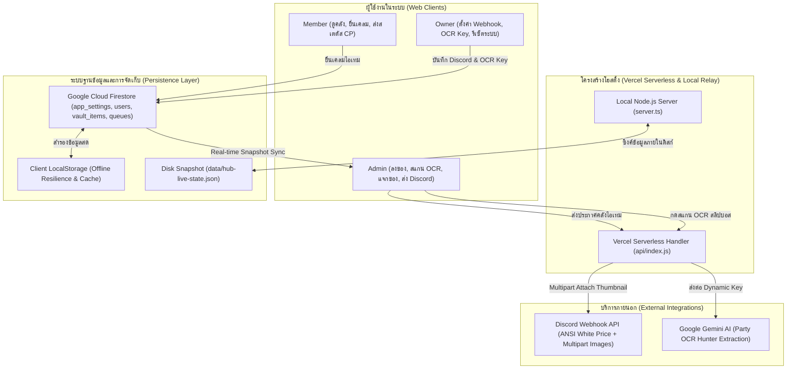

# 🛡️ Lineage2M Clan Hub — คู่มือระบบและสถาปัตยกรรมฉบับสมบูรณ์ (System Manual v2.3.0)

> **เวอร์ชันระบบ:** `v2.3.0-discord-white-price-persistence-stable`  
> **ที่เก็บซอร์สโค้ด:** `https://github.com/tinnakornid2/lineage2m-k7-item-vault`  
> **สถานะการติดตั้ง (Deployment):** Production Ready (Vercel Serverless + Node.js Live Relay)  
> **URL ระบบสด:** [https://lineage2m-k7-item-vault.vercel.app/](https://lineage2m-k7-item-vault.vercel.app/)  
> **มาตรฐานระบบสองภาษา:** รองรับภาษาไทย (TH) และภาษาอังกฤษ (EN) 100% ครบทุกจุด  
> **สแนปช็อตข้อมูล:** `backups/complete_snapshot_v2.3.0.json` (22 users, 23 vault items, 5 queue items, 23,521 diamonds)

---

## 📑 สารบัญ (Table of Contents)
1. [ภาพรวมและความเปลี่ยนแปลงในเวอร์ชัน v2.3.0 (What's New in v2.3.0)](#1-ภาพรวมและความเปลี่ยนแปลงในเวอร์ชัน-v230)
2. [สถาปัตยกรรมระบบและการไหลของข้อมูล (System Architecture & Data Flow)](#2-สถาปัตยกรรมระบบและการไหลของข้อมูล)
3. [ระบบแม่แบบข้อความและการแจ้งเตือน Discord (Discord Templates & ANSI White Price)](#3-ระบบแม่แบบข้อความและการแจ้งเตือน-discord)
4. [ระบบการบันทึกการตั้งค่าข้ามแอดมิน (Cross-Admin Firestore Persistence)](#4-ระบบการบันทึกการตั้งค่าข้ามแอดมิน)
5. [ความเสถียรบน Vercel Serverless (Serverless Reliability & Lambda Lifecycle)](#5-ความเสถียรบน-vercel-serverless)
6. [โครงสร้างสิทธิ์และการเข้าถึง (Roles & Security Permissions)](#6-โครงสร้างสิทธิ์และการเข้าถึง)
7. [การตรวจสอบข้อมูลและรายงานสำรองฉบับสมบูรณ์ (Verified Data Snapshot)](#7-การตรวจสอบข้อมูลและรายงานสำรองฉบับสมบูรณ์)
8. [ขั้นตอนการรันคำสั่งและดีพลอย (Deployment & Verification Commands)](#8-ขั้นตอนการรันคำสั่งและดีพลอย)
9. [คู่มือส่งมอบงานสำหรับนักพัฒนาท่านต่อไป (Developer Handover Guide)](#9-คู่มือส่งมอบงานสำหรับนักพัฒนาท่านต่อไป)

---

## 1. ภาพรวมและความเปลี่ยนแปลงในเวอร์ชัน v2.3.0

เวอร์ชัน **v2.3.0** เป็นการยกระดับความเสถียร ความถูกต้องของข้อมูล และความสะดวกสบายในการทำงานร่วมกันของผู้ดูแลระบบ (Admins & Owner) โดยมีไฮไลท์สำคัญดังนี้:

1. **ฟอนต์ราคาไอเทม Discord สีขาว ANSI (`\u001b[1;37m`):**
   - เปลี่ยนสีตัวอักษรของราคาเพชร เช่น `Price: FREE (0 Diamonds)` จากเดิมสีเขียว ให้เป็น **สีขาวสว่างชัดเจน (ANSI Bold White)** ตามที่ผู้ใช้งานร้องขอ
   - ครอบคลุมทั้ง 4 แม่แบบข้อความ (`neon_glow`, `war_horn`, `clan_market`, `crystal_minimal`)
   - ปรับหน้าจอพรีวิวสด (Live Preview) ใน `DiscordWebhookModal.tsx` และ `DiscordBroadcastModal.tsx` เป็นสีขาว (`text-white`) สอดคล้อง 100%

2. **ระบบบันทึก Webhook และ Gemini OCR Key ถาวรข้ามแอดมิน (Cross-Admin Shared Persistence):**
   - **แก้ปัญหาเดิม:** รีเฟรชหน้าจอแล้วข้อมูล Webhook หรือ OCR Key หลุดหาย ต้องกรอกใหม่ซ้ำ ๆ และแอดมินคนอื่นใช้ร่วมกันไม่ได้
   - **แนวทางแก้ไข:**
     - ย้ายการจัดเก็บ URL และการตั้งค่า Discord Webhook ลงเอกสาร Firestore `app_settings/discord` แบบเรียลไทม์ โดยไม่มีการเคลียร์ค่า URL ว่างเปล่าเมื่อแก้ไขส่วนอื่น พร้อมมี `localStorage` สำรอง
     - จัดเก็บคีย์ Gemini OCR ลงเอกสาร Firestore `app_settings/gemini_ai` แบบเรียลไทม์ ทำให้เมื่อ Owner ตั้งค่าคีย์แล้ว แอดมินทุกคนจะสามารถสแกน OCR สลิปปาร์ตี้บอสได้ทันทีโดยไม่ต้องกรอกคีย์เอง
     - อัปเดต `firestore.rules` อนุญาตให้ Role `Admin` และ `Owner` เข้าถึงและซิงค์เอกสารการตั้งค่านี้ได้ทันที

3. **แก้ไขข้อผิดพลาด Vercel Serverless `FUNCTION_INVOCATION_FAILED`:**
   - เปลี่ยนจากการนำเข้า `firebase-admin` แบบ Static Import มาใช้ Dynamic Import (`await import('firebase-admin')`) ป้องกันปัญหาแพ็กเกจโหลดไม่ขึ้นเมื่อไม่มี Environment Variables บน Serverless
   - ห่อหุ้ม Express Handler ด้วย Promise เพื่อรอฟังเหตุการณ์ `res.on('finish')` ป้องกันไม่ให้ Vercel/AWS Lambda ปิดการทำงานก่อนที่เซิร์ฟเวอร์จะส่ง Response กลับครบถ้วน
   - รวม Routing ทั้งหมดเป็นก้อนเดียวผ่าน `esbuild` บิลด์เข้าสู่ `api/index.js` ป้องกัน Route Collision บน Vercel
   - เพิ่ม Fast Healthcheck Endpoint `/api/health` ที่ตอบสนองในเวลาไม่ถึง 150ms

4. **ปรับเวอร์ชันระบบใน UI เป็น v2.3.0 ครบทุกจุด:**
   - `package.json`: `"version": "2.3.0"`
   - `src/components/Sidebar.tsx`: ป้ายเวอร์ชัน `v2.3.0`
   - `src/components/LoginScreen.tsx`: ป้ายเวอร์ชัน `v2.3.0`
   - `src/components/Navbar.tsx`: ป้ายเวอร์ชัน `v2.3.0`

---

## 2. สถาปัตยกรรมระบบและการไหลของข้อมูล

Lineage2M Clan Hub ทำงานด้วยสถาปัตยกรรม **High Availability Hybrid Architecture**:



---

## 3. ระบบแม่แบบข้อความและการแจ้งเตือน Discord

### 🎨 แม่แบบข้อความ 4 รูปแบบ (Discord Message Templates)
1. **🌟 Radiant Neon (`neon_glow` - ค่าเริ่มต้น):** กรอบ ANSI Syntax Highlighting เรืองแสงตามระดับไอเทม สไตล์ MMORPG
2. **⚔️ Siege & War Vault Alert (`war_horn`):** สไตล์บัญชาการรบ ดุดัน แจ้งเตือนชัยชนะบอสและเปิดสิทธิ์เคลมเสริมทัพกิลด์
3. **🏛️ Guild Treasury & Market (`clan_market`):** สไตล์ตลาดประมูลปราสาทกีรัน เน้นราคาเพชรและรายการไอเทม
4. **✨ Crystal Minimal (`crystal_minimal`):** การ์ด Embed กระชับ สวยงาม อ่านง่าย สบายตา

### 🎯 การจัดรูปแบบสี ANSI ของ Discord ใน v2.3.0:
- 🟨 **MYTHIC:** ฟอนต์สีทอง (`\u001b[1;33m`)
- 🟪 **LEGEND:** ฟอนต์สีม่วงเรืองแสง (`\u001b[1;35m`)
- 🟥 **EPIC:** ฟอนต์สีแดงเรืองแสง (`\u001b[1;31m`)
- 🟦 **RARE:** ฟอนต์สีฟ้าเรืองแสง (`\u001b[1;36m`)
- 💎 **ราคาเพชร (NEW v2.3.0):** **ฟอนต์สีขาวเด่นชัด (`\u001b[1;37m`)** เช่น:
  ```ansi
  💎 Price: FREE (0 Diamonds)
  ```
  หรือ
  ```ansi
  💎 Price: 500 Diamonds
  ```

### 🖼️ การแนบรูปภาพ Thumbnail อัตโนมัติ:
- ฟังก์ชัน `sendDiscordItemBroadcast` แปลง Base64 ของรูปไอเทมเป็น Binary Buffer และส่งผ่าน `multipart/form-data` ไปยัง Discord โดยตรง
- หากไม่มีรูป ระบบจะแนบ `DEFAULT_ITEM_ICON_BASE64` (Breka's Soul) ให้อัตโนมัติ ทำให้การ์ดแจ้งเตือนใน Discord มีรูปไอคอนที่มุมขวาบนเสมอ 100%

---

## 4. ระบบการบันทึกการตั้งค่าข้ามแอดมิน

### โครงสร้างเอกสารใน Firestore:
1. **`app_settings/discord`:**
   ```json
   {
     "webhookUrl": "https://discord.com/api/webhooks/...",
     "avatarUrl": "...",
     "username": "Lineage2M Clan Vault",
     "enabled": true,
     "mentionType": "role",
     "roleId": "123456789012345678",
     "activeTemplate": "neon_glow",
     "updatedAt": "2026-09-16T...",
     "updatedBy": "eloni"
   }
   ```
2. **`app_settings/gemini_ai`:**
   ```json
   {
     "apiKey": "AIzaSy...",
     "model": "gemini-flash-latest",
     "updatedAt": "2026-09-16T...",
     "updatedBy": "eloni"
   }
   ```

### กฎความปลอดภัยใน `firestore.rules`:
```javascript
match /app_settings/{settingId} {
  allow read: if isSignedIn();
  allow write: if isStaff(); // Owner, Admin, Manager สามารถแก้ไขและบันทึกได้
}
```

---

## 5. ความเสถียรบน Vercel Serverless

### สาเหตุและการป้องกันปัญหา `FUNCTION_INVOCATION_FAILED`:
1. **Dynamic Import สำหรับโมดูลเฉพาะฝั่งเซิร์ฟเวอร์:**
   - ใน `api/_firebaseAdmin.ts` ใช้การโหลดแบบ `const admin = await import('firebase-admin')` ภายในบล็อก `try/catch`
   - เมื่อไม่มีไฟล์ Service Account Credential บน Vercel ระบบจะข้ามไปอย่างปลอดภัยโดยไม่ Crash
2. **Lambda Lifecycle Event Wrapping ใน `api/_entry.ts`:**
   ```typescript
   export default async function handler(req: any, res: any) {
     return new Promise((resolve) => {
       res.on('finish', resolve);
       res.on('close', resolve);
       (app as any)(req, res);
     });
   }
   ```
3. **การ Bundling ด้วย esbuild:**
   - ไฟล์ต้นทางในโฟลเดอร์ `api/` ที่ไม่ได้เป็น Endpoint ตรงจะขึ้นต้นด้วยขีดล่าง `_` (เช่น `_entry.ts`, `_server.ts`, `_firebaseAdmin.ts`)
   - ผลลัพธ์สุดท้ายจะถูกรวมเป็น `api/index.js` ก้อนเดียว ทำให้ Vercel Route Match ได้ 100%

---

## 6. โครงสร้างสิทธิ์และการเข้าถึง

| บทบาท (Role) | การดูคลัง | เคลมไอเทม | แก้ไข/แจกไอเทม | ใช้งาน OCR | ตั้งค่า Webhook | ตั้งค่า Gemini Key | รีเซ็ตระบบ |
| :--- | :---: | :---: | :---: | :---: | :---: | :---: | :---: |
| **Owner (`eloni`)** | ✅ | ✅ | ✅ | ✅ | ✅ | ✅ | ✅ |
| **Admin** | ✅ | ✅ | ✅ | ✅ | ✅ | ❌ | ❌ |
| **Manager** | ✅ | ✅ | ✅ | ✅ | ✅ | ❌ | ❌ |
| **Party Leader** | ✅ | ✅ | ❌ | ❌ | ❌ | ❌ | ❌ |
| **Member** | ✅ | ✅* | ❌ | ❌ | ❌ | ❌ | ❌ |

*\*หมายเหตุ: Member ต้องมีสถานะสเตตัส CP ที่ผ่านการตรวจสอบแล้ว และค่าพลังถึงเกณฑ์ที่ไอเทมกำหนด*

---

## 7. การตรวจสอบข้อมูลและรายงานสำรองฉบับสมบูรณ์

สแนปช็อตข้อมูลสำรองสมบูรณ์เวอร์ชัน v2.3.0 ถูกบันทึกไว้ที่:
- **`backups/complete_snapshot_v2.3.0.json`**
- **`backups/complete_snapshot_latest.json`**

### ข้อมูลสถิติของระบบ (Verified System Metrics):
- **จำนวนสมาชิก (Users):** 22 บัญชี (รวมบัญชี Owner `eloni`)
- **จำนวนไอเทมในคลัง (Vault Items):** 23 รายการ
- **จำนวนคิวไอเทม (Queue Items):** 5 รายการ
- **จำนวนแคลน (Clans):** 1 แคลนหลัก
- **ยอดคงเหลือในคลังเพชร (Vault Balance):** 23,521 เพชร (Diamonds)
- **เอกสารการตั้งค่าระบบ (App Settings):** 7 เอกสาร (รวมการตั้งค่า Discord และ Gemini AI OCR)

---

## 8. ขั้นตอนการรันคำสั่งและดีพลอย

### ⚠️ กฎสำคัญสำหรับการรันคำสั่งบนเครื่อง Windows:
> **ห้ามพิมพ์คำสั่ง `npm` เดี่ยว ๆ** เพราะ Windows อาจเด้งหน้าต่างถามแอปพลิเคชัน ให้ระบุ Absolute Path ของ Node เสมอ:

```powershell
# 1. ตรวจสอบข้อผิดพลาด TypeScript (Typecheck)
& 'C:\Program Files\nodejs\node.exe' 'node_modules\typescript\bin\tsc' --noEmit

# 2. บิลด์ Production Bundle (Vite + Serverless ESBuild)
& 'C:\Program Files\nodejs\node.exe' 'node_modules\vite\bin\vite.js' build
& 'C:\Program Files\nodejs\node.exe' 'node_modules\esbuild\bin\esbuild' api/_entry.ts --bundle --platform=node --format=esm --packages=external --outfile=api/index.js
& 'C:\Program Files\nodejs\node.exe' 'node_modules\esbuild\bin\esbuild' server.ts --bundle --platform=node --format=esm --packages=external --sourcemap --outfile=dist/server.js

# 3. ส่งออกข้อมูลสำรองเวอร์ชัน v2.3.0
& 'C:\Program Files\nodejs\node.exe' 'scripts\export_complete_v2.3.0_backup.mjs'

# 4. ทดสอบความพร้อมของ Vercel API
Invoke-RestMethod -Uri 'https://lineage2m-k7-item-vault.vercel.app/api/health' -Method Get
```

---

## 9. คู่มือส่งมอบงานสำหรับนักพัฒนาท่านต่อไป

เมื่อเริ่มการทำงานในเซสชันใหม่ หรือมีนักพัฒนาท่านอื่นเข้ามารับช่วงต่อ:
1. **ห้ามลบหรือเขียนทับไฟล์สแนปช็อตในโฟลเดอร์ `backups/`**
2. **รักษามาตรฐานสองภาษา (TH & EN 100%):** ทุกครั้งที่สร้าง Component หรือแก้ไขปุ่ม/ข้อความ ต้องมีทั้งคำแปลไทยและอังกฤษ
3. **ตรวจสอบสิทธิ์ก่อนแก้ไข:** ฟังก์ชันที่มีผลต่อความปลอดภัย เช่น คีย์ Gemini หรือปุ่มรีเซ็ตระบบ ต้องจำกัดให้เฉพาะ `isOwner` เท่านั้น
4. **ทดสอบบิลด์บนเครื่อง Local ก่อนเสมอ:** รัน `tsc --noEmit` ให้ได้ 0 error ก่อนจะทำ Git Commit หรือ Deploy สู่ Production
