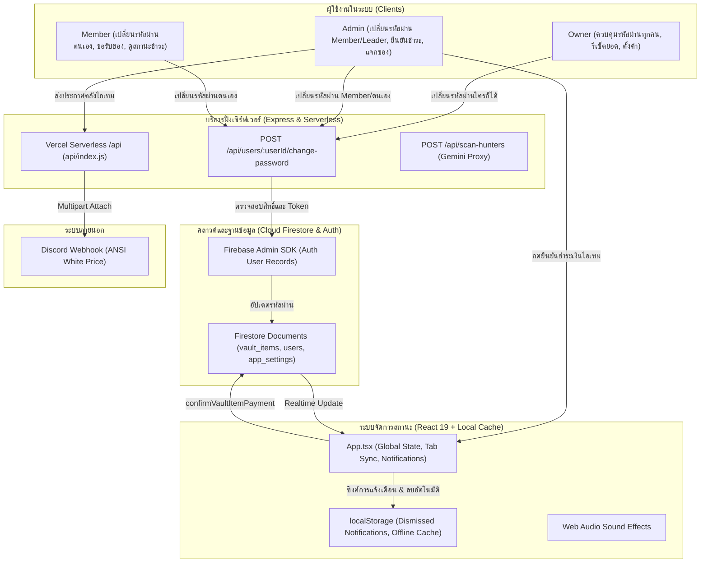

# 🛡️ Lineage2M Clan Hub — คู่มือระบบและสถาปัตยกรรมฉบับสมบูรณ์ (System Manual v2.4.0)

> **เวอร์ชันระบบ:** `v2.4.0-role-passwords-payment-tracking-stable`  
> **ที่เก็บซอร์สโค้ด:** `https://github.com/tinnakornid2/lineage2m-k7-item-vault`  
> **สถานะการติดตั้ง (Deployment):** Production Ready (Vercel Serverless + Node.js Live Relay)  
> **URL ระบบสด:** [https://lineage2m-k7-item-vault.vercel.app/](https://lineage2m-k7-item-vault.vercel.app/)  
> **มาตรฐานระบบสองภาษา:** รองรับภาษาไทย (TH) และภาษาอังกฤษ (EN) 100% ครบทุกจุด  
> **สแนปช็อตข้อมูล:** `backups/complete_snapshot_v2.4.0.json` (23 users, 23 vault items, 5 queue items, 23,521 diamonds)

---

## 📑 สารบัญ (Table of Contents)
1. [ภาพรวมและความเปลี่ยนแปลงในเวอร์ชัน v2.4.0 (What's New in v2.4.0)](#1-ภาพรวมและความเปลี่ยนแปลงในเวอร์ชัน-v240)
2. [สถาปัตยกรรมระบบและการไหลของข้อมูล (System Architecture & Data Flow)](#2-สถาปัตยกรรมระบบและการไหลของข้อมูล)
3. [ระบบเปลี่ยนรหัสผ่านตามลำดับสิทธิ์ (Role-Based Password Management)](#3-ระบบเปลี่ยนรหัสผ่านตามลำดับสิทธิ์)
4. [ระบบจัดการและล้างการแจ้งเตือน (Notification Deletion & Auto-Cleanup)](#4-ระบบจัดการและล้างการแจ้งเตือน)
5. [ระบบติดตามสถานะการชำระเงินของไอเทมแจกแล้ว (Payment Status Tracking & Confirmation)](#5-ระบบติดตามสถานะการชำระเงินของไอเทมแจกแล้ว)
6. [การปรับปรุงหน้าจอ My Stats (Thai Subtitles & Clean Input UX)](#6-การปรับปรุงหน้าจอ-my-stats)
7. [การตั้งค่าส่วนกลางข้ามแอดมินและความเสถียรบน Vercel (Shared Persistence & Serverless)](#7-การตั้งค่าส่วนกลางข้ามแอดมินและความเสถียรบน-vercel)
8. [โครงสร้างสิทธิ์และการเข้าถึง (Roles & Security Permissions Hierarchy)](#8-โครงสร้างสิทธิ์และการเข้าถึง)
9. [การตรวจสอบข้อมูลและรายงานสำรองฉบับสมบูรณ์ (Verified Data Snapshot v2.4.0)](#9-การตรวจสอบข้อมูลและรายงานสำรองฉบับสมบูรณ์)
10. [ขั้นตอนการรันคำสั่งและดีพลอย (Deployment & Verification Commands)](#10-ขั้นตอนการรันคำสั่งและดีพลอย)
11. [คู่มือส่งมอบงานสำหรับนักพัฒนาและ AI สานต่องานทันที (AI & Developer Handover Guide)](#11-คู่มือส่งมอบงานสำหรับนักพัฒนาและ-ai-สานต่องานทันที)

---

## 1. ภาพรวมและความเปลี่ยนแปลงในเวอร์ชัน v2.4.0

เวอร์ชัน **v2.4.0** มุ่งเน้นการเสริมสร้างความปลอดภัยในการจัดการบัญชีผู้ใช้ ความโปร่งใสในการเงินของไอเทมแจกจ่าย และการยกระดับประสบการณ์ผู้ใช้งาน (UX/UI) ให้สะอาดตาและใช้งานง่ายที่สุด:

### 1. ระบบเปลี่ยนรหัสผ่านตามลำดับสิทธิ์ (Role-Based Password Management)
- **ทุกคนเปลี่ยนรหัสผ่านของตนเองได้:** ผู้ใช้ทุกระดับบทบาท (`Member`, `Party Leader`, `Manager`, `Admin`, `Owner`) สามารถเปลี่ยนรหัสผ่านของตนเองได้จากแถบเมนูด้านข้าง (Sidebar) ข้างปุ่มออกจากระบบ หรือในหน้า My Stats
- **Owner เปลี่ยนรหัสผ่านให้ทุกคนได้:** บัญชี Owner มีอำนาจสูงสุดในการรีเซ็ตหรือเปลี่ยนรหัสผ่านให้กับสมาชิกทุกคนในกิลด์/ระบบ
- **Admin เปลี่ยนรหัสผ่านของตนเองและสมาชิกทั่วไปได้:** Admin สามารถเปลี่ยนรหัสผ่านของสมาชิก Member และ Party Leader ได้ แต่ **ไม่สามารถ** เปลี่ยนรหัสผ่านของ Owner หรือ Admin คนอื่นได้
- **Modal เปลี่ยนรหัสผ่านปลอดภัย (`ChangePasswordModal.tsx`):** ออกแบบสไตล์ Dark Fantasy มีระบบตรวจสอบความยาว (ขั้นต่ำ 6 ตัวอักษร), ยืนยันรหัสผ่าน (Confirm Password), ปุ่มซ่อน/แสดงรหัสผ่าน, และรองรับสองภาษา 100%
- **Backend API รองรับระดับ Serverless:** เพิ่ม Endpoint `POST /api/users/:userId/change-password` ใน `api/_server.ts` และ `server.ts` ใช้ Firebase Admin SDK ในการอัปเดตรหัสผ่านในระดับระบบ

### 2. ระบบจัดการและลบการแจ้งเตือน (Notification Center Deletion & Auto-Cleanup)
- **ปุ่มลบการแจ้งเตือนรายข้อความ:** ในหน้าต่าง Notification Center เพิ่มปุ่มถังขยะ (Trash2) ให้ผู้ใช้สามารถกดลบการแจ้งเตือนแต่ละรายการได้ทันที
- **ปุ่มล้างทั้งหมด (Clear All):** บันทึกรายการที่ลบลง `localStorage` (`l2m_dismissed_notifications`) ทำให้เมื่อปิดเปิดหน้าใหม่หรือรีเฟรช การแจ้งเตือนเก่าจะไม่เด้งกลับมา
- **ระบบลบการแจ้งเตือนขอรับของอัตโนมัติเมื่อแจกไอเทมแล้ว:** เมื่อไอเทมเปลี่ยนสถานะเป็น `distributed` ระบบจะตัดการแจ้งเตือนขอรับไอเทมชิ้นนั้นออกจาก Notification Center อัตโนมัติ เพื่อไม่ให้ค้างรกหน้าจอ

### 3. ระบบติดตามสถานะการชำระเงินของไอเทมที่แจกแล้ว (Payment Status Tracking)
- **ไอเทมที่มีราคาเพชร (`price > 0`):**
  - เมื่อแจกจ่ายแล้ว จะมีสถานะเริ่มต้นเป็น `⏳ รอชำระ` (`Pending Payment`)
  - Admin หรือ Owner สามารถกดยืนยันการชำระได้ผ่านปุ่ม `✓ ยืนยันการชำระ` (`Confirm Payment`) ในหน้าคลังไอเทม (แท็บของที่แจกแล้ว)
  - เมื่อยืนยันแล้ว สถานะจะเปลี่ยนเป็น `✓ ชำระแล้ว` (`Paid`) พร้อมบันทึกผู้กดยืนยัน (`paidBy`) และเวลาที่ยืนยัน (`paidAt`) ลง Firestore
  - มีปุ่มให้ย้อนกลับสถานะ (Revert) ได้หากกดยืนยันผิดพลาด
- **ไอเทมแจกฟรี (`price <= 0`):** แสดงสถานะ `🎁 ฟรี` (`Free`) อัตโนมัติ
- **หน้าแดชบอร์ด (Box 3 - Recent Distributions):** แสดงเฉพาะป้ายสถานะ (`ชำระแล้ว` / `รอชำระ` / `ฟรี`) อย่างสวยงาม โดยไม่มีปุ่มกดยืนยัน เพื่อรักษาความสะอาดตาและความกระชับของหน้าจอ

### 4. ปรับปรุงหน้าจอ My Stats (Thai Subtitles & Clean Input UX)
- **ชื่อสเตตัสมีวงเล็บภาษาไทยกำกับจางๆ:** เพิ่มคำแปลภาษาไทยกำกับต่อท้ายชื่อสเตตัสภาษาอังกฤษ เช่น `Damage (พลังโจมตี)`, `Accuracy (ความแม่นยำ)`, `Defense (พลังป้องกัน)`, `PvP Damage (พลังโจมตี PvP)`, `Level (เลเวล)` ฯลฯ ช่วยให้สมาชิกอ่านและกรอกค่าได้อย่างถูกต้อง
- **ลบค่าตัวเลขพื้นหลัง (Placeholder) ในช่องกรอก:** ช่องกรอกสเตตัสทุกช่องใช้ `placeholder=""` สะอาดตา ไม่มีตัวเลขหลอกตารบกวนเวลาพิมพ์
- **เพิ่มปุ่มเปลี่ยนรหัสผ่าน:** เพิ่มปุ่มเปลี่ยนรหัสผ่านในกล่องข้อมูลส่วนตัวของสมาชิก

### 5. มาตรฐานสองภาษา 100% (Mandatory Bilingual TH & EN)
- ครอบคลุมปุ่ม, ป้ายสถานะ, ข้อความแจ้งเตือน Toast, หัวข้อ Modal, และคำอธิบายทั้งหมด 100%

---

## 2. สถาปัตยกรรมระบบและการไหลของข้อมูล



---

## 3. ระบบเปลี่ยนรหัสผ่านตามลำดับสิทธิ์ (Role-Based Password Management)

### กฎลำดับสิทธิ์ (Role Hierarchy for Password Changes):
```
Owner (สิทธิ์สูงสุด)
  └── เปลี่ยนรหัสผ่านของ: ตัวเอง, Admin ทุกคน, Manager ทุกคน, Party Leader ทุกคน, Member ทุกคน
Admin (ผู้ดูแลระบบ)
  └── เปลี่ยนรหัสผ่านของ: ตัวเอง, Party Leader ทุกคน, Member ทุกคน
  └── ห้ามแตะต้อง: Owner และ Admin คนอื่น
Manager / Party Leader / Member
  └── เปลี่ยนรหัสผ่านของ: ตัวเองเท่านั้น
```

### รายละเอียด Backend Endpoint:
- **URL:** `POST /api/users/:userId/change-password`
- **Headers:** `Authorization: Bearer <Firebase_ID_Token>`
- **Request Body:**
  ```json
  {
    "newPassword": "NewPassword123"
  }
  ```
- **Response:**
  - `200 OK`: `{"success": true, "message": "Password updated successfully"}`
  - `400 Bad Request`: `{"error": "Password must be at least 6 characters"}`
  - `401 Unauthorized`: `{"error": "Unauthorized"}`
  - `403 Forbidden`: `{"error": "Admins cannot change the password of an Owner or another Admin"}`
  - `404 Not Found`: `{"error": "User not found"}`

### การใช้งานใน UI:
1. **Sidebar:** ปุ่มรูปกุญแจ "Change Password" / "เปลี่ยนรหัสผ่าน" อยู่เหนือหรือข้างปุ่มออกจากระบบ
2. **My Stats:** ปุ่ม "Change Password" ในการ์ดข้อมูลส่วนตัว
3. **Members View:** ปุ่มไอคอนกุญแจบนการ์ดของสมาชิก จะปรากฏเมื่อผู้ล็อกอินมีสิทธิ์เปลี่ยนรหัสของสมาชิกคนนั้น

---

## 4. ระบบจัดการและล้างการแจ้งเตือน (Notification Deletion & Auto-Cleanup)

### ฟังก์ชันและการทำงาน:
1. **ลบรายการแจ้งเตือนแบบรายชิ้น (Individual Delete):**
   - มีปุ่มถังขยะ `Trash2` อยู่ขวามือของแต่ละข้อความแจ้งเตือน
   - เมื่อกดลบ ระบบจะนำ ID ของการแจ้งเตือนไปบันทึกลงในรายการที่ถูกปิดกั้น (`dismissedNotificationIds`)
2. **ล้างทั้งหมด (Clear All):**
   - ปุ่มล้างทั้งหมดจะปิดการแจ้งเตือนปัจจุบันทั้งหมดและบันทึกค่าลงใน `localStorage` ภายใต้คีย์ `l2m_dismissed_notifications`
3. **การล้างอัตโนมัติเมื่อแจกจ่ายไอเทม (Auto-Cleanup on Distribution):**
   - เมื่อ Admin ทำการแจกจ่ายไอเทมสำเร็จ ระบบ `App.tsx` จะดักจับและลบการแจ้งเตือนที่มีรูปแบบ `claim-${itemId}` ออกจากการแจ้งเตือนอัตโนมัติ ทำให้สมาชิกและแอดมินไม่ต้องมากดลบซ้ำ

---

## 5. ระบบติดตามสถานะการชำระเงินของไอเทมแจกแล้ว (Payment Status Tracking)

### โครงสร้างข้อมูลใน `src/types.ts`:
```typescript
export interface DistributedInfo {
  // ...ข้อมูลเดิม
  paymentStatus?: 'pending' | 'paid';
  paidAt?: number;
  paidBy?: string;
}

export interface VaultItem {
  // ...ข้อมูลเดิม
  paymentStatus?: 'pending' | 'paid';
  paidAt?: number;
  paidBy?: string;
}
```

### วงจรสถานะ (Lifecycle):
1. **ตอนแจกไอเทม (`DistributeItemModal.tsx`):**
   - หาก `price > 0`: กำหนด `paymentStatus: 'pending'`
   - หาก `price <= 0`: กำหนด `paymentStatus: 'paid'`
2. **ในหน้าคลังไอเทม (แท็บไอเทมที่แจกแล้ว `VaultView.tsx`):**
   - แสดงป้ายสถานะกำกับใต้ราคา เช่น `⏳ รอชำระ` สีเหลืองอำพัน หรือ `✓ ชำระแล้ว` สีเขียวมรกต
   - สำหรับ Admin/Owner: แสดงปุ่มกด `✓ ยืนยันการชำระ` เพื่อเปลี่ยนสถานะเป็นชำระแล้วทันที
   - หากชำระแล้ว จะมีปุ่มย้อนกลับสถานะ (Revert) ในกรณีที่ต้องการแก้ไข
3. **ในหน้าแดชบอร์ด (`DashboardView.tsx`):**
   - ในกล่องประวัติการแจกล่าสุด (Recent Distributions) แสดงเฉพาะป้ายสถานะ `ชำระแล้ว` หรือ `รอชำระ` สวยงาม โดยไม่มีปุ่มกด เพื่อความสะอาดตา

---

## 6. การปรับปรุงหน้าจอ My Stats (Thai Subtitles & Clean Input UX)

### คำแปลภาษาไทยกำกับในวงเล็บ:
ฟังก์ชัน `getThaiStatSubtitle(key)` ใน `MyStatsView.tsx` ช่วยแมปชื่อสเตตัสภาษาอังกฤษคู่กับคำแปลไทย เช่น:
- `Damage` ➔ `Damage (พลังโจมตี)`
- `Accuracy` ➔ `Accuracy (ความแม่นยำ)`
- `Defense` ➔ `Defense (พลังป้องกัน)`
- `Damage Reduction` ➔ `Damage Reduction (ลดความเสียหาย)`
- `PvP Damage` ➔ `PvP Damage (พลังโจมตี PvP)`
- `Level` ➔ `Level (เลเวล)`
- ฯลฯ ทุกหมวดหมู่ (Combat Stats, Other Stats, Legend Skills, Spirits)

### ช่องกรอกสเตตัสสะอาดตา:
- ช่องกรอกข้อมูลตัวเลขทั้งหมดตั้งค่า `placeholder=""` ไม่มีเลข `0` หรือตัวเลขจางๆ ลอยอยู่เบื้องหลัง ทำให้ผู้ใช้เห็นค่าที่ตนพิมพ์ชัดเจน 100%

---

## 7. การตั้งค่าส่วนกลางข้ามแอดมินและความเสถียรบน Vercel

- **Firestore Shared Settings:**
  - `app_settings/discord`: เก็บการตั้งค่า Discord Webhook ข้ามผู้ดูแลระบบ
  - `app_settings/gemini_ai`: เก็บคีย์ Gemini OCR สำหรับสแกนรายชื่อผู้ล่าบอส
- **Vercel Serverless Architecture:**
  - Bundle รวมไฟล์เดียวที่ `api/index.js`
  - Dynamic Import สำหรับ `firebase-admin`
  - Lifecycle Wrapping ด้วย Promise ป้องกัน Lambda Timeout ก่อนส่งข้อมูล

---

## 8. โครงสร้างสิทธิ์และการเข้าถึง

| สิทธิ์การใช้งาน | Owner (`eloni`) | Admin | Manager | Party Leader | Member |
| :--- | :---: | :---: | :---: | :---: | :---: |
| **เปลี่ยนรหัสผ่านตนเอง** | ✅ | ✅ | ✅ | ✅ | ✅ |
| **เปลี่ยนรหัสผ่าน Member/Leader** | ✅ | ✅ | ❌ | ❌ | ❌ |
| **เปลี่ยนรหัสผ่าน Admin** | ✅ | ❌ | ❌ | ❌ | ❌ |
| **เปลี่ยนรหัสผ่าน Owner** | ✅ (เฉพาะตนเอง) | ❌ | ❌ | ❌ | ❌ |
| **ยืนยันการชำระเงินไอเทม** | ✅ | ✅ | ✅ | ❌ | ❌ |
| **ลบการแจ้งเตือนของตนเอง** | ✅ | ✅ | ✅ | ✅ | ✅ |
| **เพิ่ม/แจกจ่ายไอเทม** | ✅ | ✅ | ✅ | ❌ | ❌ |
| **ใช้งาน AI OCR สแกนผู้ล่า** | ✅ | ✅ | ✅ | ❌ | ❌ |
| **ตั้งค่า Webhook / OCR Key** | ✅ | ❌ | ❌ | ❌ | ❌ |
| **รีเซ็ตระบบ / รีเซ็ตยอดเพชร** | ✅ | ❌ | ❌ | ❌ | ❌ |

---

## 9. การตรวจสอบข้อมูลและรายงานสำรองฉบับสมบูรณ์

สแนปช็อตข้อมูลสำรองสมบูรณ์เวอร์ชัน v2.4.0 ถูกบันทึกไว้ที่:
- **`backups/complete_snapshot_v2.4.0.json`**
- **`backups/complete_snapshot_latest.json`**

### ข้อมูลสถิติของระบบ (System Metrics v2.4.0):
- **จำนวนสมาชิก (Users):** 23 บัญชี (รวม Owner `eloni`)
- **จำนวนไอเทมในคลัง (Vault Items):** 23 รายการ
- **จำนวนคิวไอเทม (Queue Items):** 5 รายการ
- **จำนวนแคลน (Clans):** 1 แคลนหลัก
- **ยอดคงเหลือในคลังเพชร (Vault Balance):** 23,521 เพชร (Diamonds)

---

## 10. ขั้นตอนการรันคำสั่งและดีพลอย

### ⚠️ กฎสำคัญสำหรับการรันคำสั่งบนเครื่อง Windows:
> **ห้ามพิมพ์คำสั่ง `npm` เดี่ยว ๆ** เพราะ Windows อาจเด้งหน้าต่างถามแอปพลิเคชัน ให้ระบุ Absolute Path ของ Node เสมอ:

```powershell
# 1. ตรวจสอบข้อผิดพลาด TypeScript (Typecheck)
& 'C:\Program Files\nodejs\node.exe' 'node_modules\typescript\bin\tsc' --noEmit

# 2. บิลด์ Production Bundle (Vite + Serverless ESBuild)
& 'C:\Program Files\nodejs\node.exe' 'node_modules\vite\bin\vite.js' build
& 'C:\Program Files\nodejs\node.exe' 'node_modules\esbuild\bin\esbuild' api/_entry.ts --bundle --platform=node --format=esm --packages=external --outfile=api/index.js
& 'C:\Program Files\nodejs\node.exe' 'node_modules\esbuild\bin\esbuild' server.ts --bundle --platform=node --format=esm --packages=external --sourcemap --outfile=dist/server.js

# 3. ส่งออกข้อมูลสำรองเวอร์ชัน v2.4.0
& 'C:\Program Files\nodejs\node.exe' 'scripts\export_complete_v2.4.0_backup.mjs'

# 4. ดีพลอยขึ้น GitHub & Vercel
git add .
git commit -m "release: v2.4.0 - role-based password management, notification deletion, payment tracking, and stat UI improvements"
git push origin main
```

---

## 11. คู่มือส่งมอบงานสำหรับนักพัฒนาและ AI สานต่องานทันที

เมื่อเปิดห้องแชทใหม่ หรือมีนักพัฒนาท่านอื่นเข้ามารับช่วงต่อ ให้คัดลอกข้อความด้านล่างนี้:

```text
โปรดอ่านไฟล์ SYSTEM_MANUAL_v2.4.0.md, AI_CONTEXT.md และ PROJECT_HANDOVER.md ในโปรเจกต์นี้ทั้งหมดก่อนเริ่มงาน
ระบบปัจจุบันคือ Lineage2M Clan Hub & Boss Item Vault (v2.4.0 — อัปเดตล่าสุด)
- บัญชี Owner: Eloni (สิทธิ์ Owner สูงสุด)
- Live Production: https://lineage2m-k7-item-vault.vercel.app/
- สถานะระบบล่าสุด (v2.4.0):
  1. ระบบเปลี่ยนรหัสผ่านตามลำดับสิทธิ์: ทุกคนเปลี่ยนของตนเองได้, Owner เปลี่ยนให้ทุกคนได้, Admin เปลี่ยนให้ Member/Leader ได้
  2. ระบบลบการแจ้งเตือนรายข้อความ + ปุ่มล้างทั้งหมด + ลบการแจ้งเตือนขอรับของอัตโนมัติเมื่อไอเทมแจกจ่ายแล้ว
  3. ระบบติดตามสถานะการชำระเงินของไอเทมแจกแล้ว (รอชำระ / ชำระแล้ว / ฟรี) พร้อมปุ่มยืนยันในหน้า Vault และแสดงสถานะสะอาดตาใน Dashboard
  4. หน้า My Stats มีวงเล็บภาษาไทยกำกับชื่อสเตตัสจางๆ อ่านง่าย พร้อมลบ placeholder ตัวเลขหลอกตาออกทั้งหมด
  5. บันทึก Discord Webhook และ Gemini OCR Key ถาวรข้ามแอดมินทุกคนผ่าน Firestore
  6. อัปเดตเวอร์ชัน v2.4.0 ครบทุกจุด (package.json, Navbar, Sidebar, LoginScreen)
  7. มีสแนปช็อตข้อมูลสำรองครบถ้วนที่ backups/complete_snapshot_v2.4.0.json (23 users, 23 vault items, 23,521 diamonds)
  8. ระบบ 2 ภาษา TH/EN 100% ทุกจุด
  9. Typecheck และ Vite Build ผ่าน 0 errors
โปรดยืนยันว่าเข้าใจสถาปัตยกรรมและกฎการป้องกันโค้ดเสียหายแล้ว พร้อมรับคำสั่งงานต่อไปครับ
```
