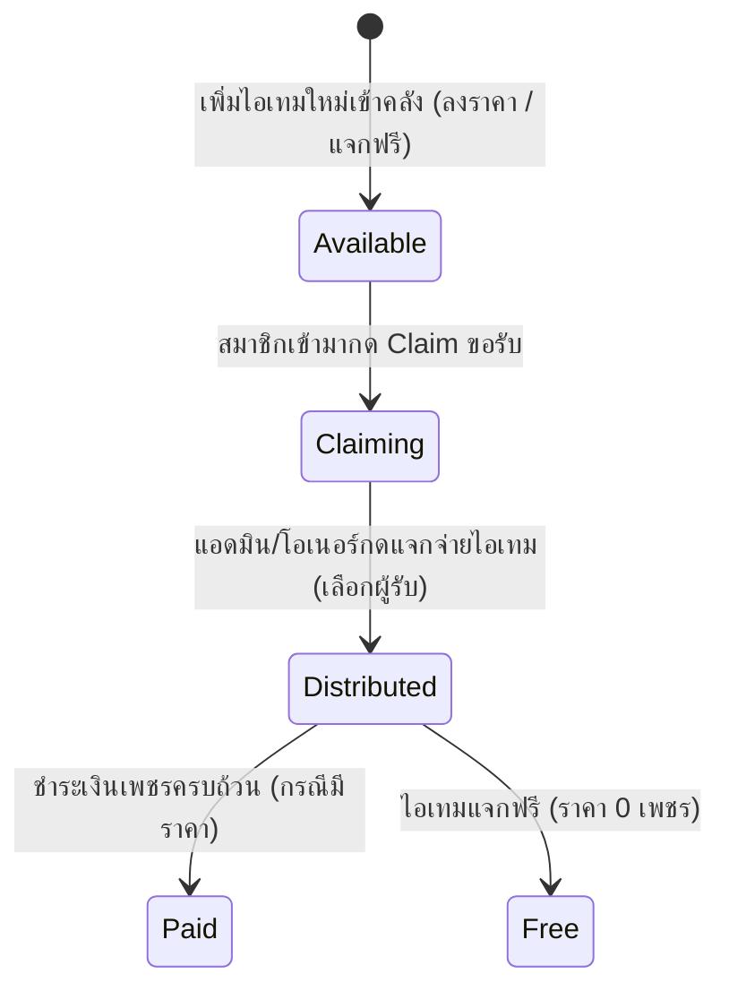
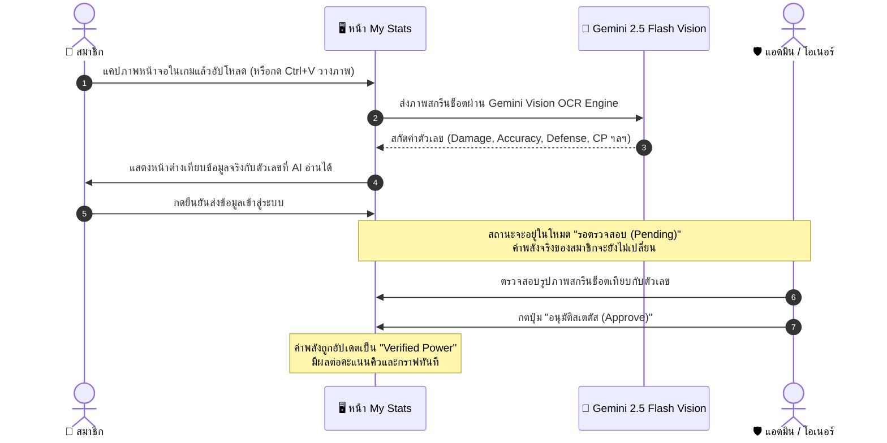

# 🎮 ระบบการทำงาน, UI/UX และเวิร์กโฟลว์ (Workflows & Features Guide)

> **Lineage 2M Clan Hub & Boss Item Vault (Version: v2.10.50)**  
> เอกสารฉบับนี้อธิบายรายละเอียดการทำงานของทุกหน้าจอ, ลอจิกการคำนวณ, เวิร์กโฟลว์ทางธุรกิจ (Business Workflows) และพฤติกรรม UI/UX ทั้งหมด เพื่อให้ผู้ดูแลระบบและนักพัฒนาเข้าใจระบบทั้งโปรเจกต์ได้ 100% โดยไม่ต้องอ่านโค้ด

---

## 🧭 โครงสร้างหน้าจอหลักและการนำทาง (Navigation & Views)

ระบบประกอบด้วย 5 หน้าหลัก พร้อมแถบสถิติด้านบน (Navbar) และเมนูด้านข้าง (Sidebar):

```text
[ แถบ Navbar ด้านบน: โลโก้แคลน | ชื่อระบบ | v2.10.50 | สลับภาษา TH/EN | ยอดเพชรกองทุน | กระดิ่งแจ้งเตือน | บัญชีผู้ใช้ ]
├─ 1. Dashboard View (หน้าหลักภาพรวมกิลด์, ไฮไลต์ไอเทมบอส, กราฟเติบโต, กองทุนเพชร)
├─ 2. Boss Item Vault (คลังไอเทมดรอปจากบอส, กด Claim ขอรับ, อัปโหลดรูป, คำนวณภาษี & แจกของ)
├─ 3. Item Queue (ระบบคิวไอเทม, ลากสลับตำแหน่งกล่องไอเทมอิสระ v2.10.50, ต่อคิวรับของ, บิลส่งมอบ)
├─ 4. Members View (ทำเนียบสมาชิกกิลด์, แบ่งหมวดแคลน VoltZ/K7, จัดอันดับค่าพลัง, จัดการสิทธิ์)
└─ 5. My Stats View (สเตตัสส่วนตัว, สแกนภาพแคปหน้าจอด้วย Gemini 2.5 Flash AI OCR, รอตรวจสอบ)
```

---

## 📦 1. ระบบคิวไอเทม (Item Queue Module) — `GeneralItemQueueCard.tsx`

ระบบคิวไอเทมเป็นศูนย์กลางการกระจายไอเทมใช้งานทั่วไป เช่น ม้วนสกิล, อุปกรณ์, หรือกล่องสุ่ม ถูกออกแบบให้มีความยืดหยุ่นสูงสุดในเวอร์ชัน `v2.10.50`:

### 1.1 การแบ่งกล่องไอเทม 2 แบบ (Dual Box Architecture)
- **👥 กล่องกดรับเอง (Open Queue - `allowMemberQueue: true`):**
  - สมาชิกทุกคนที่มีค่าพลังถึงเกณฑ์ (`powerLevel >= minPowerLevel`) สามารถกดขอรับไอเทมได้ด้วยตนเอง
  - สมาชิกสามารถระบุจำนวนชิ้นที่ต้องการ (ไม่เกิน `maxRequestQuantity`)
- **🔒 กล่องแอดมินแจก (Admin Pick - `allowMemberQueue: false`):**
  - สมาชิกทั่วไปไม่สามารถกดขอรับได้
  - ป้องกันการแย่งชิงไอเทมสำคัญ โดยเปิดให้เฉพาะ Owner หรือ Admin เป็นผู้เลือกสมาชิกเข้าคิวหรือแจกจ่ายเท่านั้น

### 1.2 การลากปรับตำแหน่งกล่องไอเทมอิสระ (Drag & Drop Reordering - v2.10.50)
Owner และ Admin สามารถจัดเรียงตำแหน่งการแสดงผลของกล่องไอเทมได้อย่างอิสระ:
- **วิธีใช้งาน:**
  - คลิกค้างที่ **ไอคอนมือจับ (Grip Vertical)** บนหัวการ์ด หรือคลิกค้างบริเวณหัวการ์ด/ขอบการ์ด แล้วลากไปยังตำแหน่งที่ต้องการ
  - รองรับทั้งใน **โหมดการ์ด (Grid View)** และ **โหมดตาราง (Table View)**
- **การตอบสนองเชิงภาพ (Visual Feedback):**
  - กล่องที่กำลังถูกลาก: จะโปร่งแสง 40% และมีกรอบเส้นประสีฟ้าไซแอน (`Cyan Dashed Ring`)
  - กล่องเป้าหมายที่จะวางทับ: จะเรืองแสงไฮไลต์สีทองอำพัน (`Amber Gold Glow`)
- **การแยกขอบเขตการลาก (Isolated Drag Scopes):**
  - ระบบใส่ `e.stopPropagation()` ป้องกันไม่ให้การลากแถวสมาชิกในคิวด้านในไปกระตุ้นการลากกล่องไอเทม
  - ปุ่มกด, อินพุต และการเลือกตัวเลือกภายในกล่องยังคงคลิกได้ตามปกติ
- **การบันทึกข้อมูล:**
  - คำนวณค่า `sortOrder` แบบเว้นช่วงตัวเลข และปรับสถานะปักหมุดตามตำแหน่งเพื่อนบ้านให้อัตโนมัติ
  - อัปเดตผ่าน React State (< 1ms), บันทึกลง LocalStorage, บรอดแคสต์ผ่าน Live State Relay และบันทึกลง Firestore แบบ Atomic Batch (`batchUpdateGeneralItemsOrder`)
- **ปุ่มลูกศรสำรอง (Arrow Up/Down):** ยังคงมีปุ่มลูกศรขึ้น/ลงให้คลิกเลื่อนทีละ 1 ขั้น สำหรับผู้ใช้งานบนโทรศัพท์มือถือ

### 1.3 เลย์เอาต์ตารางคิวผู้ขอรับ (Tabular Queue List)
- **เอาป้ายแคลนออก:** ตัดป้ายชื่อแคลนของสมาชิกในกล่องออก เพื่อไม่ให้กินพื้นที่แนวนอน
- **คอลัมน์ค่าพลังตรงกันเป๊ะ:** กำหนดความกว้างคงที่ (`w-[70px] sm:w-[76px]`) ชิดขวา ฟอนต์ Monospace (`tabular-nums font-mono text-sky-400`) แสดงตัวเลข `⚡150,000` ตรงกันทุกแถว หากไม่มีข้อมูลจะแสดงขีดสัญลักษณ์ `-` โดยไม่ทำให้แถวเบี้ยว
- **การตัดคำชื่อตัวละครยาวเกิน (Long Name Handling):**
  - ใช้ `truncate min-w-0 flex-1`: ชื่อที่ยาวมากจะถูกตัดท้ายด้วยจุดไข่ปลา (`...`) อัตโนมัติ โดยไม่มีทางดันคอลัมน์ค่าพลังให้หลุดแถว
  - มี Tooltip `title={m.name}`: เมื่อนำเมาส์ไปชี้ที่ชื่อ จะแสดงชื่อเต็มของตัวละครทันที
- **หัวคอลัมน์ย่อย (Sub-Header):** มีหัวตาราง `#` | `ชื่อตัวละคร (Character)` | `ค่าพลัง (Power)` | `รับ/ขอ (Qty)` | `จัดการ (Action)` ชัดเจน

### 1.4 การส่งมอบและประวัติบิล (Delivery & Receipt History)
- แอดมินสามารถกดปุ่ม **"แจกไอเทม"** หรือเลือกสมาชิกในคิวเพื่อทำการส่งมอบ
- ระบุจำนวนที่ส่งมอบ (Partial Delivery หรือ Complete Delivery)
- สามารถแนบภาพสกรีนช็อตหลักฐานการส่งมอบในเกม เพื่อให้สมาชิกเข้ามาตรวจสอบและกดดูภาพขยายแบบ Lightbox ได้ตลอดเวลา

---

## 🏛️ 2. คลังไอเทมบอส (Boss Item Vault) — `VaultView.tsx`

ศูนย์รวมไอเทมระดับสูงที่ดรอปจากการล่าบอสของกิลด์ (Mythic, Legend, Epic, Rare):

### 2.1 วงจรชีวิตของไอเทม (Item Lifecycle)


### 2.2 การคำนวณคะแนนสิทธิ์ขอรับ (Priority Score Calculation)
เมื่อสมาชิกกด **"ขอรับ (Claim)"** ระบบจะคำนวณลำดับความเหมาะสมจากปัจจัย:
1. **ค่าพลังตัวละคร (Combat Power):** ยิ่งค่าพลังสูงยิ่งมีภาษีดีในการใช้อุปกรณ์เพื่อช่วยทีม
2. **ความเหมาะสมของคลาส (Class Synergy):** ตรวจสอบว่าไอเทมตรงกับสายอาชีพของผู้ขอรับหรือไม่
3. **ประวัติการรับไอเทมย้อนหลัง:** หากสมาชิกเพิ่งได้รับไอเทมระดับสูงไป คะแนนจะถูกทดเวลาเพื่อให้สมาชิกคนอื่นได้รับโอกาส

### 2.3 การแจกจ่ายและการคำนวณภาษีกิลด์ (Distribution & Guild Tax Engine)
เมื่อกดปุ่ม **"แจกไอเทม (Distribute)"** ใน [`DistributeItemModal.tsx`](file:///d:/lineage2m-k7-item-vault/src/components/DistributeItemModal.tsx):
- **หักภาษีเข้ากองทุนกิลด์ (Guild Tax Deduction):** เช่น หัก 10% เข้ากองทุนเพชรของแคลน
- **กระจายเงินปันผลให้ทีมล่า (Hunter Dividends):** แบ่งเพชรที่เหลือให้แก่สมาชิกทีมล่าบอส (Boss Hunters) ตามสัดส่วน
- **ระบบติดตามการชำระเงิน (Payment Tracking):**
  - ไอเทมที่มีราคา (`price > 0`): ขึ้นป้ายสถานะ `⏳ รอชำระ` พร้อมปุ่มให้ Admin ตรวจสอบและกดยืนยันเมื่อโอนเพชรแล้วกลายเป็น `✓ ชำระแล้ว`
  - ไอเทมแจกฟรี (`price <= 0`): ขึ้นป้ายสถานะ `🎁 ฟรี` ทันที

---

## 💎 3. กองทุนเพชรของแคลน (Diamond Treasury) — `DashboardView.tsx`

- แสดงยอดคงเหลือของเพชรส่วนกลางแบบเรียลไทม์
- **สมุดบัญชีเพชรแบบ Double-Entry (`DiamondVaultRecord`):**
  - **Inflow (+):** เพชรที่ได้จากการขายไอเทมบอส, การหักภาษีเข้ากิลด์, หรือการบริจาค
  - **Outflow (-):** การจ่ายเงินปันผลให้สมาชิก, การใช้ซื้อของส่วนกลางสำหรับกิลด์วอร์
  - **Adjustment:** การปรับปรุงยอดโดย Owner พร้อมระบุเหตุผลประกอบ

---

## 👥 4. ทำเนียบสมาชิกและแคลน (Members & Clan Roster) — `MembersView.tsx`

- **การแยกสังกัดแคลน (Multi-Clan Support):** รองรับการบริหารหลายแคลนย่อยในเครือข่ายเดียว (เช่น แคลนหลัก `VoltZ`, แคลนสาขา `K7`, แคลนพันธมิตร)
- **การจัดอันดับค่าพลัง (Combat Power Ranking):** เรียงลำดับสมาชิกตามค่าพลังที่ผ่านการอนุมัติแล้ว (`Verified Power`) จากมากไปน้อย
- **กราฟประวัติค่าพลัง (CP Growth Timeline):** แสดงกราฟเส้นการพัฒนาค่าพลังของสมาชิกแต่ละคนย้อนหลัง
- **ระบบเปลี่ยนรหัสผ่านตามลำดับขั้น (Role-Based Password Management):**
  - สมาชิกเปลี่ยนรหัสผ่านของตนเองได้
  - Admin เปลี่ยนรหัสผ่านของ Member และ Party Leader ได้
  - Owner เปลี่ยนรหัสผ่านของทุกคนในระบบได้

---

## 📸 5. สแกนเนอร์สเตตัสด้วย Gemini AI OCR — `MyStatsView.tsx`

ฟีเจอร์ไฮเทคที่ช่วยให้สมาชิกไม่ต้องเสียเวลากรอกตัวเลขสเตตัสทีละช่อง:



- **สเตตัสที่ AI สกัดได้:** พลังโจมตี (Damage), ความแม่นยำ (Accuracy), พลังป้องกัน (Defense), ลดความเสียหาย (Damage Reduction), ต้านทานสกิล (Skill Resist), อัตราตีโดน (Hit Chance), ความเสียหายสกิล (Skill Damage Boost), และค่าพลังรวม (Combat Power)
- **คีย์ความปลอดภัย:** ปุ่มตั้งค่า Gemini API Key จะมองเห็นและแก้ไขได้เฉพาะ **Owner (`eloni`)** เท่านั้น

---

## 📢 6. กฎมาตรฐานการแจ้งเตือน Discord (Rule 5 Compliant)

ระบบแจ้งเตือน Discord Webhook ถูกออกแบบตามข้อกำหนดเข้มงวด:

1. **แจ้งเตือนเฉพาะเรื่องไอเทมเท่านั้น (Item-Only Notifications):**
   - ส่งเฉพาะเมื่อมีไอเทมใหม่เข้าคลัง (`new_item`) หรือเมื่อแจกของสำเร็จ (`distribute`)
   - **ห้ามส่งแจ้งเตือนเรื่องสเตตัสสมาชิกเด็ดขาด** เพื่อไม่ให้รบกวนช่องสื่อสาร
2. **ข้อความ Discord ต้องเป็นภาษาอังกฤษ 100% (Mandatory English 100%):**
   - ทั้งหัวข้อ, เนื้อหา, ANSI Code Block, และ Footer ใน Discord ต้องเป็นภาษาอังกฤษล้วน
3. **รูปแบบการ์ดแบบที่ 1 (Option 1 Standard - สั้น กระชับ สีสด):**
   - **ห้ามใส่ Title ซ้ำซ้อน:** หัวการ์ดเริ่มต้นด้วยกล่อง ANSI Code Block ทันที
   - **ตัดบรรทัดคนล่าออก 100%:** ไม่ใส่รายชื่อคนล่าใน Discord เพื่อให้ข้อความสั้นกระชับ
   - **กรอบ ANSI 2 บรรทัดคมชัด:**
     - บรรทัด 1: `[RARITY] <Item Name> (xQty)` — สีตามระดับ (Mythic เหลืองทอง, Legend ม่วง, Epic แดง, Rare ฟ้า)
     - บรรทัด 2: `💎 Price: X Diamonds` หรือ `Price: FREE (0 Diamonds)` — สีขาวสว่าง
   - **ลิงก์และรูปภาพ:** ลิงก์ `👉 [Open Vault to Claim Item](url)` พร้อมรูปภาพไอเทมจริงที่มุมขวาบน (Thumbnail)

---

## 🌐 7. ระบบสองภาษา 100% (Mandatory Bilingual TH & EN)

ทุกปุ่ม, หัวข้อ, ป้ายสถานะ, Tooltip, Dropdown, Alert, และ Toast Notification มีระบบสองภาษารองรับ 100%:
- เก็บคำแปลไว้ใน [`src/translations.ts`](file:///d:/lineage2m-k7-item-vault/src/translations.ts)
- สลับภาษาได้ทันทีผ่านปุ่มบน Navbar โดยไม่ต้องรีเฟรชหน้าเว็บ
- ห้ามเกิดกรณีภาษาผสมกันเด็ดขาด เมื่อเลือกภาษาใด หน้าจอต้องแสดงภาษานั้นครบทุกจุด

---

> 📖 **ศึกษาต่อในส่วนการ Deploy ขึ้น Production:** ดูได้ที่ **[DEPLOYMENT_GUIDE.md](DEPLOYMENT_GUIDE.md)**
